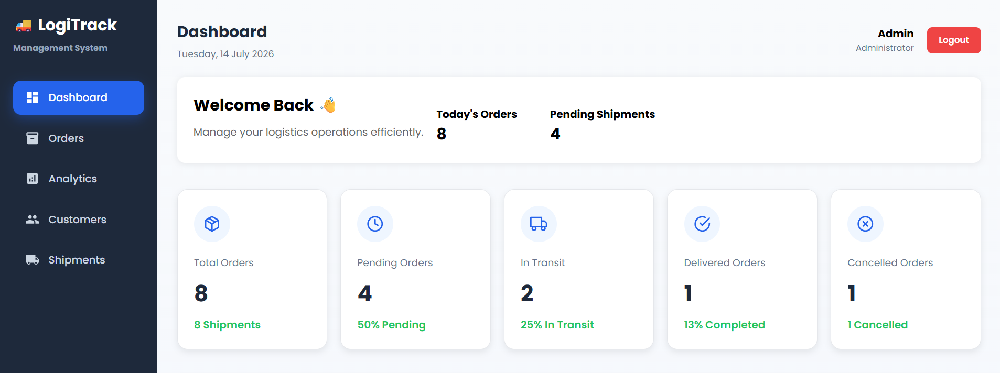
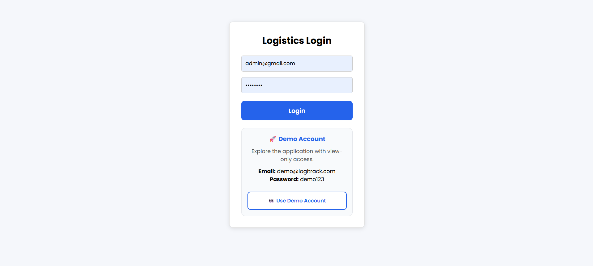
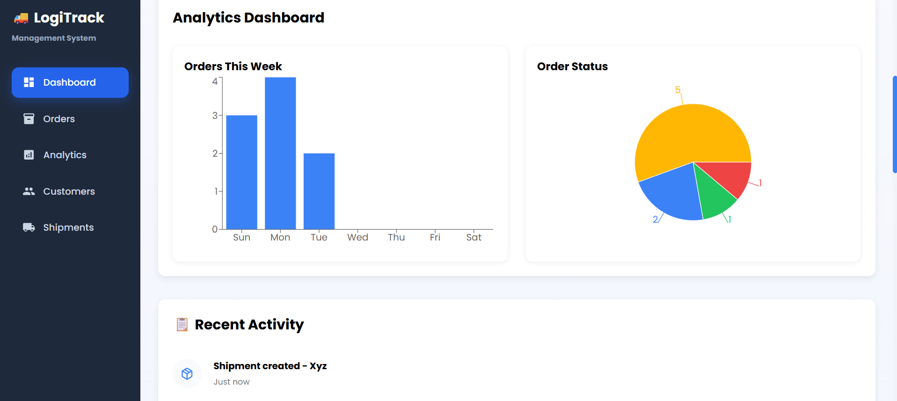
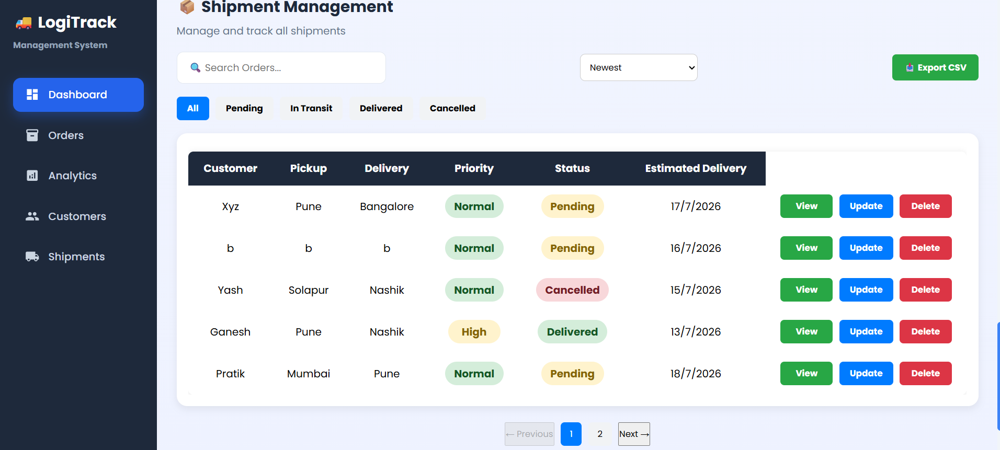
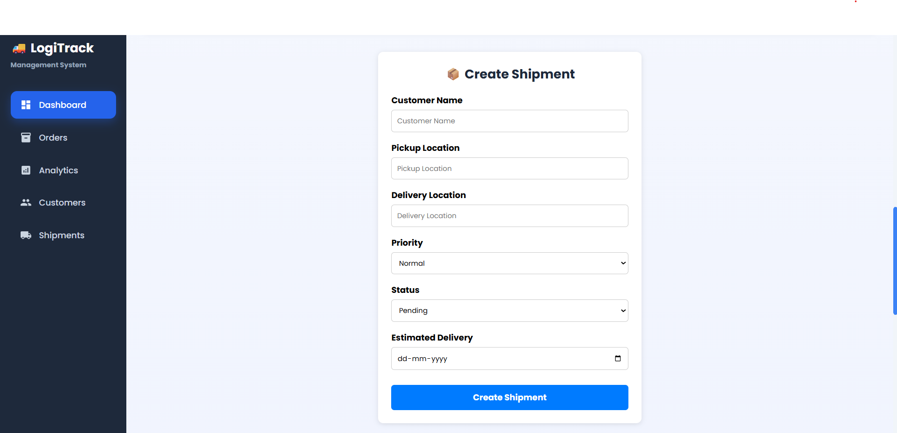
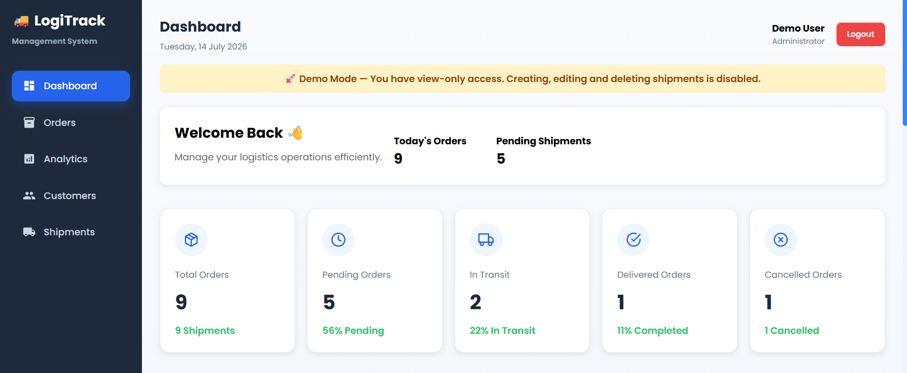

# 🚚 LogiTrack – Logistics Management System


**LogiTrack** is a modern Logistics Management System built using React, Node.js, Express, MongoDB Atlas, and JWT Authentication. It enables administrators to efficiently manage shipments through a secure dashboard while providing a demo account with view-only access for evaluation.

---
## 📸 Project Preview




## 🌐 Live Demo

**Frontend (Vercel)**  
https://logistics-management-system-dusky.vercel.app

**Backend API (Render)**  
https://logitrack-backend-kb1x.onrender.com

---

## 🔑 Demo Credentials

### 👀 Demo Account (View Only)

**Email:** demo@logitrack.com

**Password:** demo123

>The demo account is provided for recruiters, faculty, and evaluators to explore the application safely with view-only access.

---

## ✨ Features

- 🔐 JWT Authentication
- 👤 Admin & Demo User Roles
- 🔒 Role-Based Access Control (Admin & Demo)
- - 🚛 Shipment Management (Create, Read, Update & Delete)
- 👨‍💼 Admin Dashboard
- 👀 Demo View-Only Mode
- 📊 Dashboard Analytics
- 📈 Interactive Charts
- 🔍 Shipment Details
- 🔔 Toast Notifications
- 📱 Responsive Design
- 🎨 Modern UI
- ☁️ Cloud Deployment
- 🔒 Protected API Routes
- ⚡ Fast React Interface

---

## 🔒 Security

- JWT Authentication
- Password Hashing using bcrypt
- Protected API Routes
- Role-Based Authorization

## 📸 Screenshots

### Login Page



---

### Dashboard


---



### Shipment Management



---

### Create Shipment



---

### Demo Mode



---

## 🛠 Tech Stack

### Frontend

- React.js
- HTML5
- CSS3
- JavaScript (ES6+)
- React Toastify
- Recharts
- React Icons

### Backend

- Node.js
- Express.js
- JWT
- bcrypt
- REST API

### Database

- MongoDB Atlas
- Mongoose ODM

### Deployment

- Vercel
- Render

---

## 🏛 Architecture

Frontend (React)
        │
 REST API (JWT)
        │
Backend (Node.js + Express)
        │
MongoDB Atlas


## 🏗 Project Structure

```
logistics-app
│
├── backend
│   ├── middleware
│   ├── models
│   ├── routes
│   ├── index.js
│   └── package.json
│
├── public
├── src
│   ├── components
│   ├── App.js
│   ├── Login.js
│   └── ...
│
├── README-images
├── package.json
└── README.md
```

---

## ⚙ Installation

### Clone Repository

```bash
git clone https://github.com/nageshfulari/Logistics-Management-System.git
```

### Frontend

```bash
npm install
npm start
```

### Backend

```bash
cd backend
npm install
npm start
```

---

## 🔐 Environment Variables

### Backend (.env)

```env
PORT=5000

MONGO_URI=your_mongodb_connection_string

JWT_SECRET=your_secret_key
```

### Frontend (.env)

```env
REACT_APP_API_URL=http://localhost:5000
```

---

## 🚀 Future Enhancements

- Email Notifications
- Real-Time Shipment Tracking
- Google Maps Integration
- QR Code Shipment Verification
- Advanced Analytics Dashboard
- Multi-User Role Management
- Export Reports (PDF & Excel)

---

## 👨‍💻 Author

**Nagesh Fulari**

Bachelor of Engineering (Computer Engineering)

GitHub:
https://github.com/nageshfulari

---

## ⭐ Support

If you found this project useful, consider giving it a ⭐ on GitHub.

## 📄 License

This project is developed for educational and portfolio purposes.